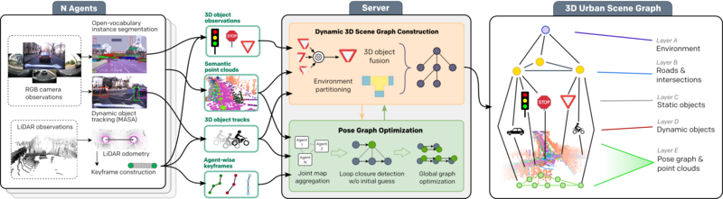

# CURB-OSG
[**arXiv**](https://arxiv.org/abs/) | [**Website**](https://ov-curb.cs.uni-freiburg.de/) | [**Video**](https://youtu.be/LEP_LZQzUV4)

This repository is the official implementation of the paper:

> **Collaborative Dynamic 3D Scene Graphs for Open-Vocabulary Urban Scene Understanding**
>
> [Tim Steinke]()&ast;, [Martin Büchner](https://rl.uni-freiburg.de/people/buechner)&ast;, [Niclas Vödisch](https://vniclas.github.io/)&ast;, and [Abhinav Valada](https://rl.uni-freiburg.de/people/valada). <br>
> &ast;Equal contribution. <br> 
> 
> *preprint*, 2025

<p align="center">
  
</p>

If you find our work useful, please consider citing our paper:
```
@article{steinke2025curbosg,
  author={Steinke, Tim and Büchner, Martin and Vödisch, Niclas and Valada, Abhinav},
  title={Collaborative Dynamic 3D Scene Graphs for Open-Vocabulary Urban Scene Understanding},
  journal={preprint},
  year={2025},
}
```

**Make sure to also check out our previous work on this topic:** [**CURB-SG**](https://github.com/robot-learning-freiburg/CURB-SG).


## 📔 Abstract

Mapping and scene representation are fundamental to reliable planning and navigation in mobile robots. While purely geometric maps using voxel grids allow for general navigation, obtaining up-to-date spatial and semantically rich representations that scale to dynamic large-scale environments remains challenging. In this work, we present CURB-OSG, an open-vocabulary dynamic 3D scene graph engine that generates hierarchical decompositions of urban driving scenes via multi-agent collaboration. By fusing the camera and LiDAR observations from multiple perceiving agents with unknown initial poses, our approach generates more accurate maps compared to a single agent while constructing a unified open-vocabulary semantic hierarchy of the scene. Unlike previous methods that rely on ground truth agent poses or are evaluated purely in simulation, CURB-OSG alleviates these constraints. We evaluate the capabilities of CURB-OSG on real-world multi-agent sensor data obtained from multiple sessions of the Oxford Radar RobotCar dataset. We demonstrate improved mapping and object prediction accuracy through multi-agent collaboration as well as evaluate the environment partitioning capabilities of the proposed approach.


## 👩‍💻 Code

We will release the code upon the acceptance of our paper.

## 👩‍⚖️  License

For academic usage, the code is released under the [GPLv3](https://www.gnu.org/licenses/gpl-3.0.en.html) license.
For any commercial purpose, please contact the authors.


## 🙏 Acknowledgment

We thank Kenji Koide for open-sourcing the ROS package [hdl_graph_slam](https://github.com/koide3/hdl_graph_slam) that we use as base for our multi-agent LiDAR SLAM framework.

This work was funded by the German Research Foundation (DFG) Emmy Noether Program grant number 468878300.
<br><br>
<p float="left">
  <a href="https://www.dfg.de/en/research_funding/programmes/individual/emmy_noether/index.html"></a>  
</p>
