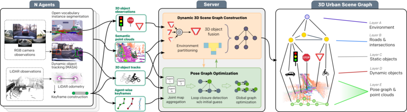

# CURB-OSG
[**arXiv**](https://arxiv.org/abs/2503.08474) | [**Website**](https://ov-curb.cs.uni-freiburg.de/) | [**Video**](https://youtu.be/HCvelmrWrlY)

This repository is the official implementation of the paper:

> **Collaborative Dynamic 3D Scene Graphs for Open-Vocabulary Urban Scene Understanding**
>
> [Tim Steinke]()&ast;, [Martin Büchner](https://rl.uni-freiburg.de/people/buechner)&ast;, [Niclas Vödisch](https://vniclas.github.io/)&ast;, and [Abhinav Valada](https://rl.uni-freiburg.de/people/valada). <br>
> &ast;Equal contribution. <br> 
>
> IEEE/RSJ International Conference on Intelligent Robots and Systems (IROS), 2025

<p align="center">
  
</p>

If you find our work useful, please consider citing our paper:
```
@article{steinke2025curbosg,
  author={Steinke, Tim and Büchner, Martin and Vödisch, Niclas and Valada, Abhinav},
  title={Collaborative Dynamic 3D Scene Graphs for Open-Vocabulary Urban Scene Understanding},
  journal={IEEE/RSJ International Conference on Intelligent Robots and Systems (IROS)},
  year={2025},
}
```

**Make sure to also check out our previous work on this topic:** [**CURB-SG**](https://github.com/robot-learning-freiburg/CURB-SG).


## 📔 Abstract

Mapping and scene representation are fundamental to reliable planning and navigation in mobile robots. While purely geometric maps using voxel grids allow for general navigation, obtaining up-to-date spatial and semantically rich representations that scale to dynamic large-scale environments remains challenging. In this work, we present CURB-OSG, an open-vocabulary dynamic 3D scene graph engine that generates hierarchical decompositions of urban driving scenes via multi-agent collaboration. By fusing the camera and LiDAR observations from multiple perceiving agents with unknown initial poses, our approach generates more accurate maps compared to a single agent while constructing a unified open-vocabulary semantic hierarchy of the scene. Unlike previous methods that rely on ground truth agent poses or are evaluated purely in simulation, CURB-OSG alleviates these constraints. We evaluate the capabilities of CURB-OSG on real-world multi-agent sensor data obtained from multiple sessions of the Oxford Radar RobotCar dataset. We demonstrate improved mapping and object prediction accuracy through multi-agent collaboration as well as evaluate the environment partitioning capabilities of the proposed approach.


## 👩‍💻 Code

## Setup
First make sure to clone this repository with `--recurse-submodules` to recursively fetch some dependencies.

### Development Container Deployment
You can set up this project as a [Dev Container](https://code.visualstudio.com/docs/devcontainers/containers) in [Visual Studio Code](https://code.visualstudio.com/). Make sure you have Docker running and follow these steps:

1. Open this project in VS Code, then open the command palette by pressing `CTRL-Shift-P` and run the command `Dev Containers: Reopen in Container`.
2. This will automatically build a dev container with all requirements and set up the project under the directory `/workspaces/collaborative-scene-graphs` inside the docker.
3. The container should now be open in VS code and ready for use. To re-build the container (e.g. after making changes to the config in `.devcontainer`), run the command: `Dev Containers: Rebuild Container`.

See the [Dev Container documentation](https://code.visualstudio.com/docs/devcontainers/containers) for more details and how to fix issues.

For manual setup without the dev container (untested) follow the steps described in `.devcontainer/Dockerfile` and `.devcontainer/container-setup.sh`.

### First Compilation
After the setup is completed (make sure VS Code is opened _inside_ the dev container), go to the main directory (where this README is located), then run:
```
source /opt/ros/noetic/setup.bash
catkin build
source devel/setup.bash
```

It may be necessary to run `catkin build` multiple times to ensure all dependencies are built and found.

If you want to use clangd for development, install [catkin-tools-clangd](https://pypi.org/project/catkin-tools-clangd/) and run `catkin build_compile_cmd` instead to generate clangd compile commands.

### Download Datasets
- **Oxford Radar Robotcar:** Acquire the dataset by applying for a download permission on the [homepage](https://oxford-robotics-institute.github.io/radar-robotcar-dataset/) and download a few of the datasets (only the following sensors are relevant: Bumblebee XB3, Velodyne HDL-32E Left, NovAtel GPS / INS, Grasshopper Left, Right & Rear, Navtech CTS350-X Radar Optimised SE2 Odometry). Then unzip the files into the `./data/radar-robotcar/` directory. We randomly selected the following sequences for our evaluation:
  - https://oxford-robotics-institute.github.io/radar-robotcar-dataset/datasets/2019-01-11-13-24-51-radar-oxford-10k
  - https://oxford-robotics-institute.github.io/radar-robotcar-dataset/datasets/2019-01-14-14-15-12-radar-oxford-10k
  - https://oxford-robotics-institute.github.io/radar-robotcar-dataset/datasets/2019-01-15-13-06-37-radar-oxford-10k

After successfully completing the downloads, your data directory should have the following structure:
```
data
└── radar-robotcar
    ├── 2019-01-11-13-24-51-radar-oxford-10k
    │   ├── gps
    │   ├── gt
    │   ├── mono_left
    │   ├── mono_left.timestamps
    │   ├── mono_rear
    │   ├── mono_rear.timestamps
    │   ├── mono_right
    │   ├── mono_right.timestamps
    │   ├── stereo
    │   ├── stereo.timestamps
    │   ├── velodyne_left
    │   ├── velodyne_left.timestamps
    │   ├── velodyne_right
    │   └── velodyne_right.timestamps
    ├── 2019-01-14-14-15-12-radar-oxford-10k
    │   ├── gps
          ...
    │   └── velodyne_right.timestamps
    ├── 2019-01-15-13-06-37-radar-oxford-10k
    │   ├── gps
          ...
    │   └── velodyne_right.timestamps
```

### Download Models
#### MASA-GDINO
```
cd /workspaces/curb-osg-deploy-test/src/curb_projection/saved_models/masa_models
wget https://huggingface.co/dereksiyuanli/masa/resolve/main/gdino_masa.pth
```

#### SAM
```
cd /workspaces/curb-osg-deploy-test/src/curb_projection/saved_models/pretrain_weights
wget https://dl.fbaipublicfiles.com/segment_anything/sam_vit_h_4b8939.pth
```

#### Open-Vocabulary Landmark Detection
Based on [OpenGraph](https://github.com/BIT-DYN/OpenGraph/tree/master?tab=readme-ov-file). Our setup requires the following weights:
```
cd /workspaces/curb-osg-deploy-test/src/curb_projection/saved_models
# Tag2Text
wget https://huggingface.co/spaces/xinyu1205/Tag2Text/resolve/main/tag2text_swin_14m.pth
# Grounding DINO
wget https://github.com/IDEA-Research/GroundingDINO/releases/download/v0.1.0-alpha/groundingdino_swint_ogc.pth
# Tokenize Anything via Prompting
wget https://huggingface.co/BAAI/tokenize-anything/resolve/main/models/tap_vit_l_v1_1.pkl
```

### Precomputing MASA
Since we found MASA inference too slow for our real-time use case, we decided to simulate faster inference by precomputing and playing back the track data. Use the following script to do so, or disable dynamic object tracking in the `curb_launchers/launch/curb_osg.launch` file.
```
roslaunch curb_projection offline_masa_processor.launch dataset_root:=PATH_TO_DATASET camera_name:=stereo/left  # or {mono_left,mono_right,mono_rear}
```
**Note:** this takes several hours, depending on your hardware.

### :rocket: Run
After downloading the dataset and models, you can execute the scene graph mapping for three agents with default parameters by running:
```
roslaunch curb_launchers curb_osg.launch 
```
The first run will download some more models for the perception of landmarks. Subsequent runs will use the cached weights.

To visualize the scene graph, we prepared an Rviz config:
```
rviz -d /workspaces/curb-osg-deploy-test/src/curb_launchers/config/curb_osg.rviz
```
If running in a remote development container, you may not be able to open rviz from the command line. In this case, we recommend setting up a virtual desktop inside the dev container by following this [manual](https://github.com/microsoft/vscode-dev-containers/blob/main/script-library/docs/desktop-lite.md). You can then connect to the virtual desktop via VNC and launch rviz from a terminal there.

### Automatic Evaluation
To execute multiple evaluation runs automatically, we prepared an automatic evaluation [script](src/curb_launchers/scripts/auto_eval_node.py). By default, the results and logs will be written to `./metrics/`

### 🚗🚙🛻 ROS Player to Simulate Multiple Radar RobotCar Agents

We separately release our developed tool for multi-agent urban mapping based on the Oxford Radar RobotCar Dataset.
Please find the code at this link: https://github.com/TimSteinke/multi_robotcar

## 👩‍⚖️  License

For academic usage, the code is released under the [GPLv3](https://www.gnu.org/licenses/gpl-3.0.en.html) license.
For any commercial purpose, please contact the authors.


## 🙏 Acknowledgment

We thank Kenji Koide for open-sourcing the ROS package [hdl_graph_slam](https://github.com/koide3/hdl_graph_slam) that we use as base for our multi-agent LiDAR SLAM framework.

This work was funded by the German Research Foundation (DFG) Emmy Noether Program grant number 468878300.